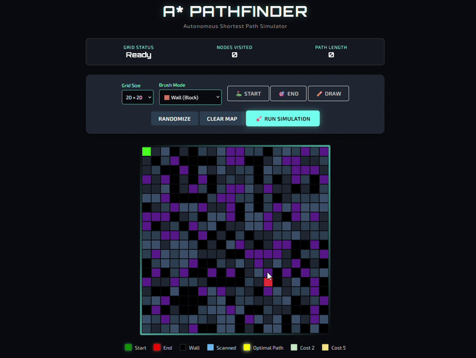

# 🚀 Cyberpunk A* Pathfinding Visualizer

A full-stack pathfinding simulator that visualizes the **A* Search Algorithm** in real-time. Built with a Python (Flask) backend and a custom JavaScript frontend, featuring a responsive cyberpunk interface.



## 🌟 Features
* **Real-time Visualization:** Watch the algorithm scan nodes and find the shortest path.
* **Interactive Grid:** Draw walls, move start/end nodes, and randomize maps.
* **Weight Mapping:** Supports different terrain costs (Normal, Medium, High, Extreme).
* **Full-Stack Architecture:** * **Backend:** Python (Flask) handles the heavy A* logic.
    * **Frontend:** HTML5 Canvas & JavaScript for high-performance rendering.

## 🛠️ Tech Stack
* **Python** (Flask, NumPy)
* **JavaScript** (ES6, Canvas API)
* **CSS3** (Cyberpunk/Neon UI)

## 💻 How to Run Locally
Since this project uses a Python backend for calculations, follow these steps:

1.  **Clone the repository**
    ```bash
    git clone [https://github.com/HarshalKushwaha0027/A-star---Algorithm-for-shortest-path-problems.git](https://github.com/HarshalKushwaha0027/A-star---Algorithm-for-shortest-path-problems.git)
    cd A-star---Algorithm-for-shortest-path-problems
    ```

2.  **Install Dependencies**
    ```bash
    pip install flask flask-cors
    ```

3.  **Run the Server**
    ```bash
    python app.py
    ```

4.  **Open the App**
    Go to your browser and type: `http://10.15.101.67:5001/`

## 🤝 Contributing
Feel free to fork this project and add new algorithms (Dijkstra, BFS) or improved heuristics!